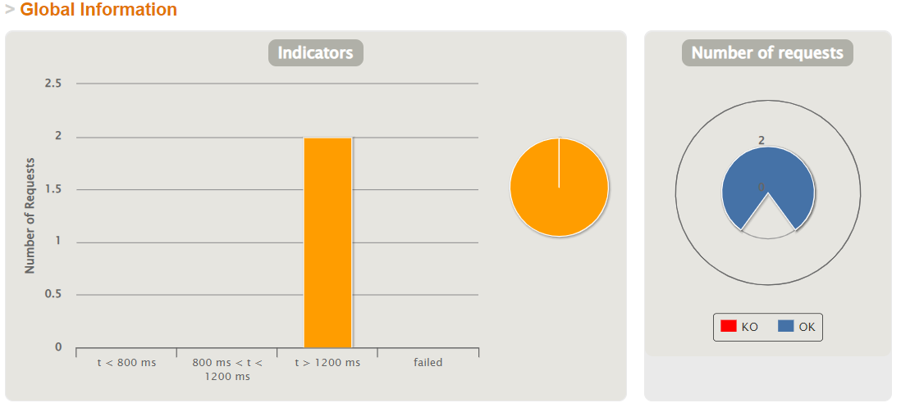
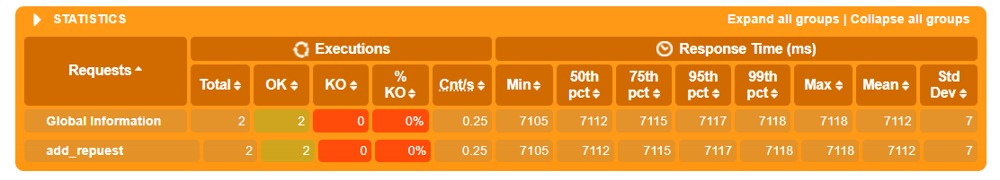

# aw10-final

项目尚未完全修改为reactive

##功能模块
###pos-discovery
作为注册中心，使用eureka为每个微服务提供节点

###pos-gateway
作为网关，用户访问可以可以全部发往该网关，网关将请求转发至每个微服务节点
端口号9527

###pos-products
商品管理模块，为系统提供商品相关的服务接口，端口号随机
```
/api/products
get: 查看所有商品信息
/api/products/{productId}
get: 根据id查询某一特定商品信息
```


###pos-counter
用于计算购物车价格，端口号随机

###pos-carts
购物车模块，商品可加入购物车中，为系统提供购物车相关的服务接口，端口号随机
```
/api/cart
get: 查看购物车中所有商品		
/api/cart/add/{productId}
post: 购物车中添加商品
/api/cart/checkout
```

###pos-delivery
用于查询，修改订单状态

###pos-order
订单模块

##性能测试
由于尚未完全实现reactive，电脑性能较差，单单开启8个微服务电脑已经非常卡，测试使用数据较小，不太具有参考性。




Please develop a **fully functional** online purchase order system.

- It should have a superb collection of goods merchandises
- Customer can browse/search for merchandises, add selected one into his shopping cart and checkout to complete a transaction.
- User can get delivery status updates continuously.

The system should be of a **reactive architecture**, which means it should be 

-  Responsive: it should response to the user request timely.
-  Resilient: it should not be easily broken down.
-  Elastic: it should be flexible to scale out.
-  Message Driven: it should has loosely coupled components that communicates with each other asynchronously.


Please design tests/experiements to demostrate that your system fulfills such requirements as stated in [The Reactive Manifesto](https://www.reactivemanifesto.org)

**Submit your codes/documents/tests/experiements of your system.**
